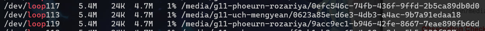
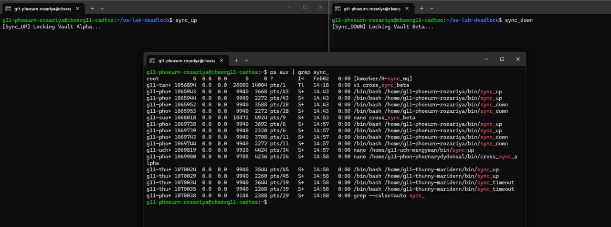
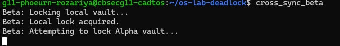
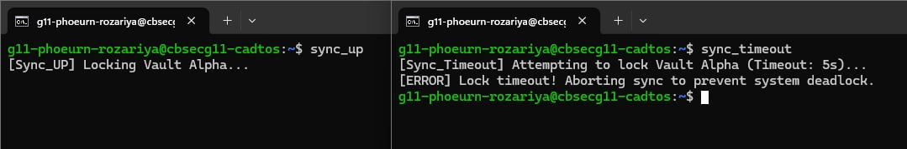
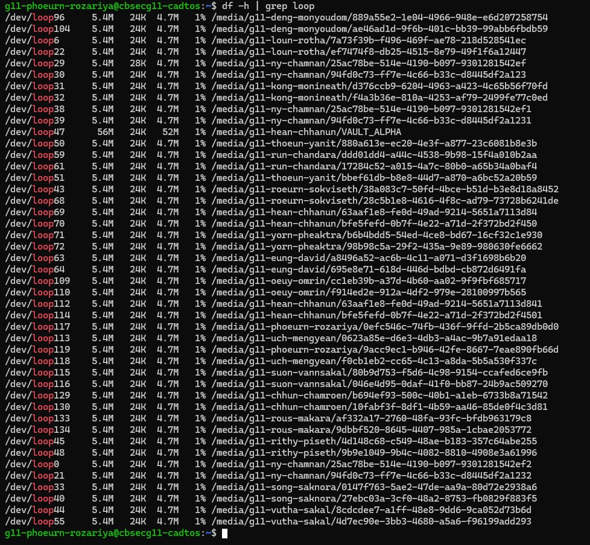

# os-lab-deadlock-IDTB110147
Operating Systems &amp; Security Lab: The Quantum Vault Deadlock

Student ID: IDTB110147

---
## Level 1: Virtual Vault Provisioning (Formatting & Mounting)

**Explaination:**
The output shows that loop devices owned by phoeurn-rozariya (/dev/loop117 and /dev/loop119) are successfully mounted under /media/g11-phoeurn-rozariya/.... This proves that the user’s loopback devices are active and properly mounted, making them ready for use in the lab.

## Level 3: The Local Circular Wait (Triggering Deadlock)

**Explaination:**
The scripts froze because each process held one lock and waited for another lock held by the other process, creating a circular wait and causing a deadlock.

## Level 4: Site-to-Site Sync (Multiplayer Deadlock)

**Explaination:**
In this task, Player A and Player B each lock their own file and then try to lock the other player’s file at the same time. This creates a situation where each process is waiting for a resource held by the other, causing a deadlock.
As a result, both scripts freeze because neither can continue. This simulates a distributed system failure where multiple users or services become stuck waiting on each other, similar to a denial-of-service condition.

## Level 5: Global Resource Ordering (The Patch)

**Explaination:**
In this level, deadlock is avoided by making both players follow the same lock order: Alpha first, then Beta. This removes the circular wait condition.
When both scripts run, Player B waits for Alpha instead of locking Beta first. Player A finishes and releases the locks, then Player B continues.
This shows that enforcing a consistent global order prevents deadlocks in distributed systems.

## Level 6: Deadlock Recovery (The Timeout Patch)

**Explaination:**
In this level, a timeout is used to prevent processes from waiting indefinitely for a lock. Instead of blocking forever, the script waits for a limited time (5 seconds) and then aborts if the lock is not available.
When the lock is held by another process, the script pauses briefly and then exits with an error message instead of freezing. This breaks the infinite wait condition.
This strategy improves server health by preventing stuck processes, freeing system resources, and allowing other operations to continue instead of being permanently blocked.

## Level 7: Safe Ejection (Teardown)

**Explaination:**
In this level, we safely unmount virtual vaults and detach loopback devices instead of deleting them while mounted. Proper teardown prevents file system corruption, orphaned devices, and potential data loss.
By unmounting first and then removing loop devices, the system frees kernel resources and ensures the virtual images are no longer in use. Running a cleanup check (e.g., df -h | grep loop) confirms that no loop devices remain.
This practice is critical for system stability, preventing resource leaks and maintaining a consistent, uncorrupted file system.

